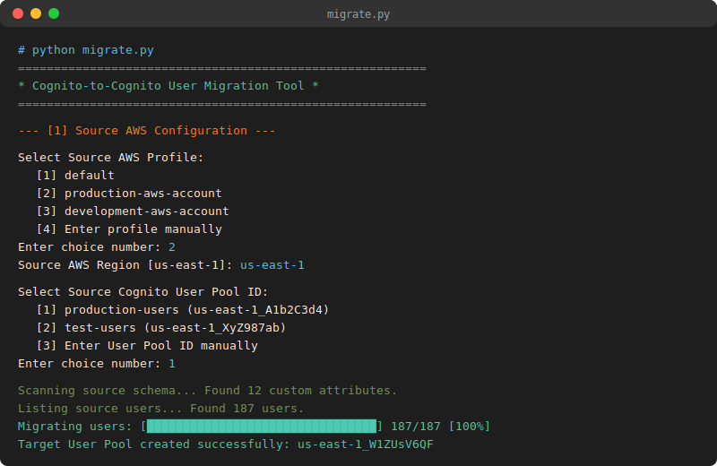

# Cognito-to-Cognito User Migration Tool



A lightweight, standalone Python CLI utility to migrate AWS Cognito User Pools, schemas, client app settings, user groups, and user profiles between AWS accounts or regions.

Because AWS Cognito does not support the export of hashed passwords, this tool bulk-migrates user records with secure, generated temporary passwords. Users are marked as `FORCE_CHANGE_PASSWORD` and will be prompted to set a new password on their first login.

---

## Features

* **Schema Replication:** Reads the source User Pool configuration and recreates it in the target account, automatically retaining all custom attributes (case-sensitivity and datatype constraints are preserved).
* **App Client Setup:** Copies app client profiles (name, allowed OAuth flows, callback/logout URLs, token validity periods) to the new pool.
* **Groups & Memberships:** Automatically recreates user groups (description, role ARNs, precedence) and associates migrated users to their respective groups.
* **Flexible Notification Options:**
  1. **Auto-Send Emails:** Let AWS Cognito send welcome emails containing temporary passwords directly to the users.
  2. **Suppress & Export:** Create users silently and output their temporary passwords to a local CSV file, allowing you to notify them using your own email marketing tool.

---

## Setup & Requirements

1. Make sure **Python 3** is installed:
   ```bash
   python --version
   ```

2. Install the AWS SDK dependency:
   ```bash
   pip install -r requirements.txt
   ```

3. Ensure your local terminal is authenticated with your AWS accounts (via standard credentials files or `aws sso login`).

---

## Running the Migration

The tool supports two execution modes: **Interactive Wizard** and **Automated Command Line**.

### Mode A: Interactive Wizard (Default)
Simply run the script with no arguments. The CLI will guide you step-by-step:
```bash
python migrate.py
```
1. **Source Profile:** Lists and lets you choose from your locally configured AWS profiles.
2. **Source Region:** Enter your source AWS region (defaults to `us-east-1`).
3. **Source Pool ID:** Lists all user pools in the selected region for you to choose from.
4. **Target Settings:** Select target AWS profile, region, and action (recreate or migrate into existing).
5. **Notification Preference:** Select whether to let Cognito send invite emails or output temporary passwords silently to a local CSV file.

---

### Mode B: Automated CLI (For Scripts / CI/CD)
To bypass the wizard prompts and automate execution, pass the configuration arguments directly:
```bash
python migrate.py \
  --src-profile source-profile \
  --src-pool-id us-east-1_MockPoolId123 \
  --tgt-profile target-profile \
  --tgt-pool-name my-recreated-user-pool \
  --suppress-emails \
  --csv-path ./output_credentials.csv \
  --yes
```

#### Available CLI Arguments:
* `--src-profile`: Source AWS CLI profile name (Required for automated mode)
* `--src-pool-id`: Source Cognito User Pool ID (Required for automated mode)
* `--tgt-profile`: Target AWS CLI profile name (Required for automated mode)
* `--src-region`: Region for source pool (Default: `us-east-1`)
* `--tgt-region`: Region for target pool (Default: `us-east-1`)
* `--tgt-pool-name`: Name of new target pool to create
* `--tgt-pool-id`: ID of an existing target User Pool to migrate into (bypasses pool creation)
* `--suppress-emails`: Suppress Cognito welcome notifications and generate a CSV log
* `--csv-path`: Custom path to save the output CSV credentials (Default: `./migrated_users_credentials.csv`)
* `--yes`: Bypasses the final confirmation summary block and executes immediately
* `--verbose`: Enables debug-level logging outputs in the console

---

## Understanding the Outputs & CSV File

When running the migration with email notifications suppressed (`--suppress-emails` flag or Option 2 in the interactive menu), the script creates all users silently in the target User Pool and generates a local credentials CSV file (default: `migrated_users_credentials.csv`).

### CSV File Structure
The generated file uses a simple, standard header structure:
```csv
Username,Email,TemporaryPassword
user_a@example.com,user_a@example.com,akb=q9$uiDDB
user_b@example.com,user_b@example.com,%^6P54GhC)em
```
> [!NOTE]
> If your User Pool is configured for email-based logins (`UsernameAttributes: ["email"]`), the `Username` and `Email` columns will contain identical email values. For standard username-based pools, they will show their distinct Cognito usernames.

### How to Use the CSV File
1. **Import to Email tools:** Import this CSV file into Amazon SES, SendGrid, Mailchimp, or your own backend notification service.
2. **Send Welcome Emails:** Send an email to each user with their temporary password:
   > **Subject:** Your account has been migrated!
   > 
   > Hi, we have upgraded our authentication services. To access your account on our new platform, please sign in using:
   > * **Email:** `{Email}`
   > * **Temporary Password:** `{TemporaryPassword}`
   > 
   > On your first sign-in, you will be prompted to set a new password to secure your account.
3. **Forced Reset Flow:** When the user enters these temporary credentials, Cognito intercepts the login attempt and returns a `NEW_PASSWORD_REQUIRED` challenge, forcing them to set a new password before they are granted access.

### 🔒 Security Best Practices
* **Never commit this CSV to Git:** The file contains temporary plaintext passwords. It is ignored by default in the `.gitignore` included in this repository.
* **Delete after use:** Once you have sent out your welcome emails, make sure to permanently delete the CSV file from your local machine.
